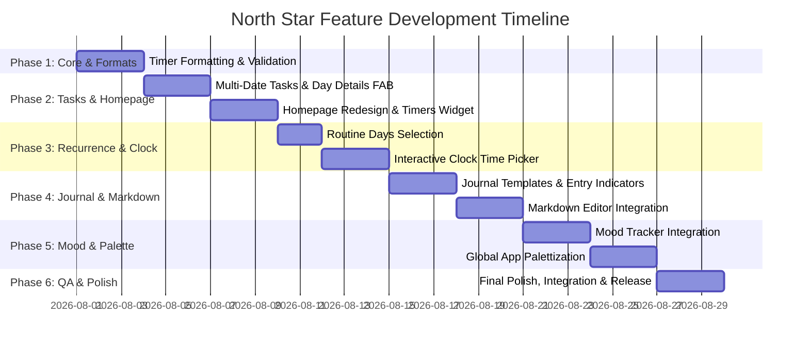

# Product Requirement Document (PRD) & Development Timeline

## Project: North Star App — Feature Enhancements & Redesign

---

## 1. Executive Summary & Goals

The goal of this release cycle for **North Star** is to transform the application into a highly intuitive, visually stunning, and feature-rich daily routine & habit tracking ecosystem. Key pillars of this update include:

1. **Precision & Usability**: Standardizing timer formats (`1h 30m`), implementing interactive clock pickers, and enforcing strict input validation.
2. **Flexible Task Management**: Supporting multi-date task creation (past/future) directly from the Day Details view and customizable days-of-the-week routine scheduling.
3. **Optimized Homepage Experience**: Elevating the primary dashboard to focus on current-day timers with completion indicators while removing redundant navigation entry points.
4. **Rich Journaling & Reflection**: Introducing pre-built and custom templates, rich Markdown editing, and calendar entry indicators.
5. **Holistic Well-being & Aesthetics**: Integrating a Mood Tracker and applying a unified, modern, palettized design system across the entire application.

---

## 2. Detailed Feature Requirements (PRD)

### Feature 1: Timer Formatting (`1h 30m`)
* **Problem**: Currently, durations are displayed purely in total minutes (e.g., `90m`, `120m`), which becomes difficult to parse at a glance for longer durations.
* **Requirements**:
  * Implement a helper utility `formatDuration(seconds: number)` / `formatMinutes(minutes: number)`.
  * Format outputs:
    * `< 60 mins`: `45m`
    * `>= 60 mins`: `1h 30m`, `2h`, `3h 15m`
  * Update all screens showing task targets, active timers, logs, and analytics.

---

### Feature 2: Multi-Date Task Creation & Day Details Integration
* **Problem**: Tasks can currently only be created for the current day ("today"), restricting forward planning and historical logging.
* **Requirements**:
  * **Date Selector in `AddTaskScreen`**: Allow selecting any past or future date via a date picker.
  * **Creation from `DayDetailsScreen`**: Add a "Add Task for this Day" button that opens `AddTaskScreen` pre-populated with the viewed date.
  * **Data Model Alignment**: Store date-specific tasks under `state.tasks[YYYY-MM-DD]`.

---

### Feature 3: Routine Task Recurrence & Streak Integrity
* **Problem**: Routine tasks repeat every single day by default without custom weekly scheduling options.
* **Requirements**:
  * **UI Selector**: On routine task creation/editing, add a 7-day pill selector (`Mon`, `Tue`, `Wed`, `Thu`, `Fri`, `Sat`, `Sun`).
  * **Default State**: All 7 days selected by default.
  * **Data Model Update**: Add `daysOfWeek?: number[]` (0=Sun, 1=Mon, ..., 6=Sat) to the `Task` interface in `types/index.ts`.
  * **Filtering Logic**: In `getTasksForDate(date)`, only include routine tasks if the specified date's day-of-week is included in `task.daysOfWeek`.
  * **Streak Integrity on Non-Activity Days**: When calculating streak counts, non-scheduled days (days of the week not selected in `task.daysOfWeek`) must be ignored so that streaks do not break on off/rest days.

---

### Feature 4: Homepage Optimization & Dashboard Redesign
* **Problem**: Homepage contains redundant entry points to the calendar tab and displays "Currently Active Timers" rather than an overview of all current day timers.
* **Requirements**:
  * **Current Day Timers Card**: Replace "Currently Active Timers" with a **Current Day Timers Overview** section that displays:
    * All timer-type tasks scheduled for today.
    * Real-time progress bar / ring indicator showing completion percentage (e.g. `45m / 60m` = `75%`).
    * Direct Play/Pause button for instant tracking.
  * **Streamline Navigation & Entry Points**:
    * Audit homepage header, calendar widgets, and shortcut buttons.
    * Replace redundant calendar entry points with high-value quick actions: **Quick Journal Entry**, **Mood Log**, and **Analytics Highlight**.

---

### Feature 5: Advanced Journaling System
* **Problem**: Journal entries are currently plain text with a rigid structure.
* **Requirements**:
  * **Journal Templates**:
    * 4–5 pre-defined templates (e.g., *Daily Reflection*, *Gratitude & Positivity*, *Bullet Journaling*, *Weekly Review*, *Morning Intentions*).
    * Default option: **Blank Document**.
  * **Custom Template Creator**: Allow users to save their custom prompt structures for reuse.
  * **Rich Markdown Editor**:
    * Support formatting toolbar: Headings (`H1`, `H2`, `H3`), **Bold**, *Italic*, Bullet Lists, Numbered Lists, and Font Size adjustments.
    * Real-time Markdown preview mode.
  * **Calendar Entry Indicators**:
    * On the Journal screen calendar view, mark dates with a visual dot indicator 🟢 to signal an existing journal entry.

---

### Feature 6: Mood Tracker Integration
* **Problem**: Overall well-being and daily mood are not captured alongside tasks and journals.
* **Requirements**:
  * **Daily Mood Logging**: 5-point scale (😄 *Great*, 🙂 *Good*, 😐 *Okay*, 😔 *Down*, 😤 *Stressed*) with custom optional tag selections (*Work*, *Exercise*, *Family*, *Sleep*, etc.).
  * **Home & Journal Widget**: Show today's logged mood on the homepage and attach mood metadata to journal logs.
  * **Analytics Integration**: Correlate mood trends with task completion percentages over weekly/monthly views.

---

### Feature 7: Interactive Clock Time Picker (Time Jot Inspired)
* **Problem**: 24-hour wheel/scroll pickers are clunky for setting reminders.
* **Requirements**:
  * **Analog Clock Dial UI**: Custom interactive clock face component.
  * **Dial Modes**: Toggle between Hours (1–12 / 00–23) and Minutes (00–59) with smooth touch drag gesture handlers.
  * **AM/PM Toggle**: Clean segment selector for morning/afternoon.

---

### Feature 8: Unified App-wide Palettization & Design System
* **Problem**: Colors across screens lack a centralized, curated design palette.
* **Requirements**:
  * **Theme System (`theme.ts`)**: Define a cohesive, premium color palette:
    * Primary Accent: Deep Slate Blue / Emerald Teal
    * Secondary Accent: Warm Amber / Sunset Rose
    * Dark/Light Backgrounds: Soft neutral off-whites & dark glassmorphism hues
    * Semantic Statuses: Success, Warning, Neutral Muted
  * **Component Refactoring**: Update buttons, cards, tags, navigation headers, and modal overlays to use standardized design tokens.

---

### Feature 9: Form Validation & Data Integrity
* **Requirements**:
  * **Category Name Uniqueness**: Enforce case-insensitive uniqueness check when adding or editing categories (`categories.some(c => c.name.toLowerCase() === input.toLowerCase())`).
  * **Counter Task Constraints**: Enforce numeric-only input on the counter target field (disable non-numeric keyboard input & validate `> 0`).

---

## 3. Development Timeline & Execution Phases

### Detailed Breakdown

| Phase | Duration | Scope & Key Deliverables |
|---|---|---|
| **Phase 1: Formatting & Validation** | Days 1–3 | `formatDuration` helper, Category name uniqueness check, Counter input numeric restrictions. |
| **Phase 2: Tasks & Homepage** | Days 4–8 | Past/Future date selection in task creation, FAB in `DayDetailsScreen`, Current Day Timers Overview with progress rings, Homepage navigation cleanup. |
| **Phase 3: Recurrence & Clock** | Days 9–13 | Routine 7-day selection UI, streak integrity for off-days, Interactive analog clock picker component. |
| **Phase 4: Advanced Journaling** | Days 14–19 | Journal templates (4-5 presets + custom creator), Markdown editor component with toolbar, Calendar date entry indicators. |
| **Phase 5: Mood & Palettization** | Days 20–25 | Mood tracker modal & analytics widget, Unified `theme.ts` color design system refactoring. |
| **Phase 6: Integration & Polish** | Days 26–28 | End-to-end testing, performance optimizations, bug fixes, release packaging. |

---
